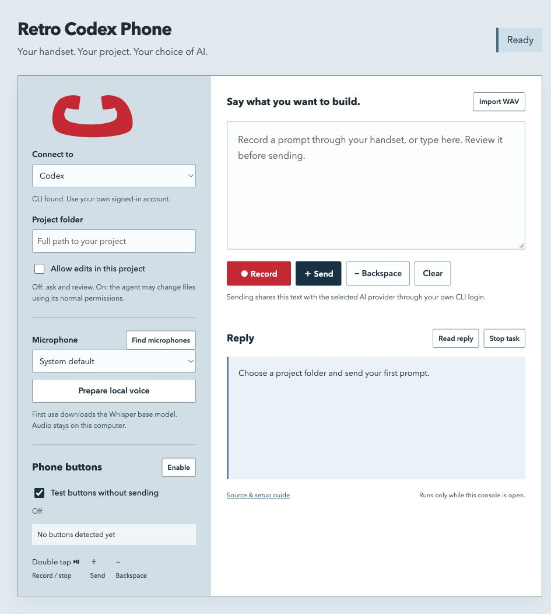

# Retro Codex Phone ☎️

**Give your coding assistant a retro handset. Speak, review, then send.**

A small local console that turns a USB or headset-style telephone handset into a voice controller for **Codex CLI or Claude Code**. Audio is transcribed locally; your reviewed prompt is sent through your own agent login. No private API, app modification, or always-on recording.

[Download the starter ZIP](https://github.com/lydiahub19921013/retro-codex-phone/releases/latest) · [Setup guide](docs/SETUP.md) · [中文说明](docs/README.zh.md)

[Watch the studio phone experiment](https://www.youtube.com/watch?v=wqmpUhXXg7o) · [Software checks](https://github.com/lydiahub19921013/retro-codex-phone/actions/runs/36457308846)



## What you get

- Choose Codex or Claude for each job, with an explicit project folder.
- Select the handset microphone, speak, and edit the transcript before sending.
- Double-tap the play/pause button to start or stop recording; **＋** sends the reviewed prompt and **−** acts as backspace. On-screen controls work without media buttons.
- Test media buttons without sending anything. A microphone working does **not** prove that the same adapter exposes its buttons.
- See the agent reply in the console, stop a task, or read its reply aloud through your system output device.
- Read-only/plan mode by default. File editing is a separate, visible opt-in.

If this helps your workflow, a **Star** helps other handset tinkerers find it. Follow [LydiaHub](https://github.com/lydiahub19921013) for the next experiments. Useful bug reports and hardware compatibility notes are welcome too.

## Quickstart

Requires **Python 3.11+**, Chrome/Edge or another browser with microphone capture, and one signed-in coding CLI. The voice model is downloaded only when you click **Prepare local voice**. The default Whisper base model is roughly 145 MB; the ZIP does not include models.

```sh
git clone https://github.com/lydiahub19921013/retro-codex-phone.git
cd retro-codex-phone
python3 -m venv .venv
# macOS / Linux:
source .venv/bin/activate
# Windows PowerShell instead: .venv\Scripts\Activate.ps1
python -m pip install -r requirements.txt
python -m retro_phone
```

Or extract the release ZIP and use `start-mac.command` / `start-windows.bat`.

1. Connect the handset as a microphone. A real telephone with only an RJ11 telephone-line plug is not a computer headset.
2. Open the console at `http://127.0.0.1:8768` and choose an existing project folder.
3. Prepare voice, then click **Find microphones** and select the handset.
4. Record a short prompt, stop, review, and press **Send**.
5. Optional: enable **Phone buttons**. Keep test mode on first and press all three buttons. Disable test mode only after the console detects the events you need.

macOS button support uses the small Swift adapter in `native/`. The source ZIP compiles it on demand with Apple's command-line tools. macOS may require Input Monitoring and Accessibility for the launcher/helper; the app never grants these permissions itself. Windows uses a standard media-key hook. Both listeners run only when enabled and stop after the console goes inactive.

## Why a companion console?

[AI-Commander](https://github.com/YuJonny/AI-Commander) is an existing MIT project that maps a headset button to dictation tools and already includes Codex/Claude presets. This is an **independently implemented companion**, focused on dispatching a reviewed voice prompt to a chosen coding project, with the answer visible in the same console.

| Workflow | AI-Commander | This project |
|---|---|---|
| Voice into the current application | Main workflow | Use the editable local prompt console |
| Coding assistant selection | Shortcut presets | Explicit Codex/Claude CLI dispatch |
| Destination | Current text cursor | Chosen project folder, frozen for each job |
| Handset controls | Play/pause trigger | Double-tap record, plus send, minus backspace |
| Transcript approval | Depends on target input tool | Review before sending |
| Agent result | In the target application | Returned to the same console |

The console is useful when you want deliberate project routing and a review step. AI-Commander remains a good choice for general dictation into any app. This is not a claim that every aspect is better, or that either program supports every handset.

## Supported / not yet verified

This first release is an experimental companion to our studio phone video. The video demonstrates a desktop dictation setup; this implementation uses coding CLIs behind a local console rather than injecting text into the desktop app.

- macOS: console, source compilation, audio transcription and dispatch logic are checked in the development environment. Physical handset buttons still need your hardware test.
- Windows: the media hook and launcher are included; a real Windows/handset acceptance run is pending.
- Codex/Claude must be installed and signed in separately. Account plan, quotas and task costs belong to that CLI/provider. This release does not bypass their permissions or approval requirements.
- Some 3.5 mm / USB-C adapters expose audio but no media events. No software can recover a button event the adapter never reports.
- There is no hardware phone ringing, SIP calling, autonomous pickup, conversation memory across separate CLI jobs, or guarantee of microphone/button compatibility.

See [verification and limitations](docs/VERIFICATION.md) for the current evidence. Tests do not substitute for physical device acceptance.

## Privacy & stopping

Audio is processed by faster-whisper on this computer, then removed from its temporary folder. The console keeps the current transcript and reply in memory, not a permanent log. **Send** shares the text/project task with the chosen coding agent using its existing account and normal configuration. That CLI may keep its own history and access the selected folder.

No browser/cloud speech service is used for transcription. Optional **Read reply** uses your browser/OS speech voice; choose a local voice if that matters for your setup. Close the terminal with Ctrl+C to stop the server and release the model. Closing the console stops the media listener after a short heartbeat timeout. No launch agent or autostart service is installed.

## Development

```sh
python -m unittest discover -s tests -v
# macOS compile check; does not start a listener or ask for permissions:
swiftc native/MediaButtons.swift -o /tmp/retro-phone-media-check
```

Original code: MIT, LydiaHub. Related projects, dependency licenses and source links are recorded in [THIRD_PARTY_NOTICES.md](THIRD_PARTY_NOTICES.md).
